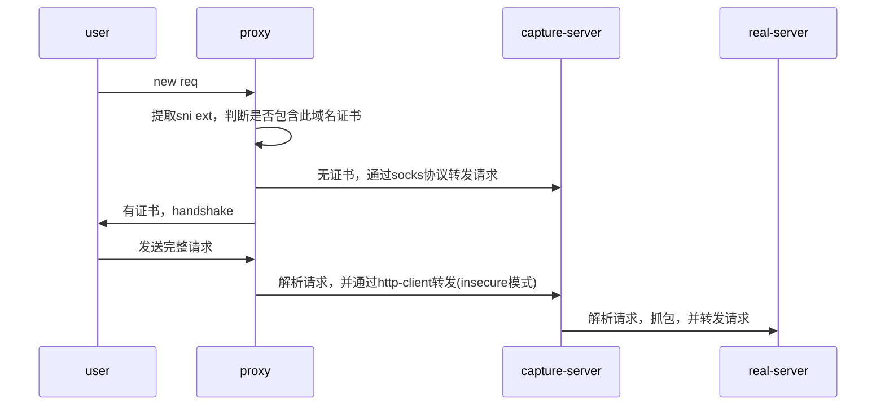

### 背景

1. 常用抓包工具：charles,fiddler,mitm等，
   1. http：设置系统代理
   2. https:  导入根证书
2. 为什么有些app上抓不到包
   1. no-proxy , 原因：httpclient实现比较多，并不能保证都完整支持http协议规范
      1. drony,Thor,surge 模拟vpn网络，拦截请求后转发到代理服务
   2. ssl pinning，例：nodejs 自带根证书，不使用操作系统中的根证书
      1. 根证书
      2. https证书校验：可考虑关闭https 证书校验
      3. 使用http请求
      4. 导入生产环境的证书（不安全）

### 实现思路

#### 目标

1. 多租户
2. 证书安全

#### 思路



效果图：


### 管理后台


### 使用说明

```
说明:
1. 客户端IP 是要抓包的机器(如手机/pc等)的IP地址，从各机器上查看
2. 代理IP 是抓包软件的IP，如charles或fiddler提供的代理地址
操作步骤:
1. 启动charles等抓包软件，记住代理IP，格式如 10.238.23.2:8888
2. 查看要抓包的客户端的IP，如手机或PC的本机IP，格式如：10.238.23.5
3. 在管理后台添加客户端IP和代理IP
4. 在要抓包的机器的设置DNS(10.238.17.13)或修改HOST(10.238.17.13 note.youdao.com)
5. 运行要抓包的app即可
注意:
1. 抓包软件和要抓包的app不应在同一个机器上，如要测试pc上的electron客户端时应在另一台机器上运行抓包软件
```

### 参考实现

https://github.com/snaigle/sniproxy